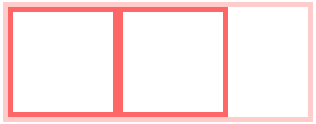

BFC神奇背后的原理
===============

## BFC是什么？

BFC就是Box、Formatting Context 的概念。

### Box：CSS布局的基本单位

Box是css布局的对象和基本单位，直观点说，就是一个页面是由很多个Box组成的。元素的类型和display属性，决定了这个Box的类型。不同类型的Box,会参与不同的Formatting Context(一个决定如何渲染文档的容器)，因此Box内的元素会以不同的方式渲染。让我们看看有哪些盒子：

*	**block-level box** `display`属性为block，list-item，table的元素，会生成block-level box并参与block fomatting context；
*	**inline-level box** `display`属性为inline, inline-block, inline-table的元素，会生成inline-level box并参与inline fomatting context；
*	**run-in box** css3中才有

### Formatting context

Formatting context是W3C css2.0规范中的一个概念。它是页面中的一块如黯然区域，并且有一套渲染规则，它决定了其子元素将如何定位，以及和其他元素的关系和相互作用。最常见的Formatting context有Block formatting context（简称BFC）和Inline formatting context（简称IFC）。

css2.1中只有BFC和IFC，css3中还增加了GFC和FFC。

### BFC定义

BFC（Block formatting context）直译为“块级格式化上下文”。它是一个独立的渲染区域，只有Block-level box参与，它规定了内部的Block-level Box如何布局，并且与这个区域外部毫不相干。

### BFC布局规则：

*	内部的BOX会在垂直方向上，一个接着一个地放置
*	BOX垂直方向的距离由margin决定。术语同一个BFC的两个相邻BOX的margin会发生重叠
*	每个元素的margin box的左边，与包含块border box的左边相接触（对于从左往右的格式化，否则相反）。及时存在浮动也是如此。
*	BFC的区域不会与float box重叠
*	BFC就是页面上的一个隔离独立容器，容器里面的子元素不会影响到外部的元素。反之也是如此。
*	计算BFC的高度时，浮动元素也参与计算

## 那些元素会生成BFC？

*	根元素
*	float属性不为none
*	position为absolute或fixed
*	display为inline-block、table-cell、table-caption、flex、inline-flex
*	overflow不为visible

## BFC的作用及原理

1.	自适应两栏布局

```html

<style>
    body {
        width: 300px;
        position: relative;
    }
 
    .aside {
        width: 100px;
        height: 150px;
        float: left;
        background: #f66;
    }
 
    .main {
        height: 200px;
        background: #fcc;
    }
</style>
<body>
    <div class="aside"></div>
    <div class="main"></div>
</body>

```

页面：


根据BFC布局规则第三条：

```

每个元素的margin box的左边，与包含块的border box的左边相解除（对于从左往右的格式化，否则相反）。即使存在浮动也是如此

```

因此，虽然存在浮动的元素aside，但main的左边依然会与包含块的左边想接触。

根据BFC布局规则第四条：

```

BFC的区域不会与float box重叠

```

我们可以通过触发main生成BFC，来实现自适应两栏布局。

```css

.amin {
	overflow: hidden;
}

```

当触发main生成BFC后，这个心的BFC不会与浮动的aside重叠。因此会根据包含块的宽度，和aside的宽度，自动变窄。效果如下：


2.	清除内部浮动

代码：

```html

<style>
    .par {
        border: 5px solid #fcc;
        width: 300px;
    }
 
    .child {
        border: 5px solid #f66;
        width:100px;
        height: 100px;
        float: left;
    }
</style>
<body>
    <div class="par">
        <div class="child"></div>
        <div class="child"></div>
    </div>
</body>

```

页面：


根据BFC布局规则第六条：

```

计算BFC的高度时，浮动元素也参与计算

```

为达到清除内部浮动，我们可以出发par生成BFC，那么par在计算高度时，par内部的浮动元素child也会参与计算。

代码：

```css

.par {
	overflow: hidden;
}

```

效果如下：



3.	防止垂直margin重叠

代码：

```html

<style>
    p {
        color: #f55;
        background: #fcc;
        width: 200px;
        line-height: 100px;
        text-align:center;
        margin: 100px;
    }
</style>
<body>
    <p>Haha</p>
    <p>Hehe</p>
</body>

```

页面：


两个p之间的距离为100px，发送了margin重叠。

根据BFC布局规则第二条：

```

Box垂直方向的距离由margin决定。属于同一个BFC的两个相邻Box的margin会发生重叠

```

我们可以在p外部包裹一层容器，并处罚金该容器生成BFC。那么两个P便不属于同一个BFC，就不会发生margin重叠了。

代码：

```html

<style>
    .wrap {
        overflow: hidden;
    }
    p {
        color: #f55;
        background: #fcc;
        width: 200px;
        line-height: 100px;
        text-align:center;
        margin: 100px;
    }
</style>
<body>
    <p>Haha</p>
    <div class="wrap">
        <p>Hehe</p>
    </div>
</body>

```

效果如下：


## 总结

其实以上的几个例子都是体现了BFC布局规则的第五条：

```

BFC就是页面上的一个隔离的独立容器，容器里面的子元素不会影响到外部的元素。反之也是如此。

```

因为BFC内部的元素和外部的元素绝对不会互相影响，因此， 当BFC外部存在浮动时，它不应该影响BFC内部Box的布局，BFC会通过变窄，而不与浮动有重叠。同样的，当BFC内部有浮动时，为了不影响外部元素的布局，BFC计算高度时会包括浮动的高度。避免margin重叠也是这样的一个道理。

转自[前端精选文摘：BFC 神奇背后的原理](http://www.cnblogs.com/lhb25/p/inside-block-formatting-ontext.html)


